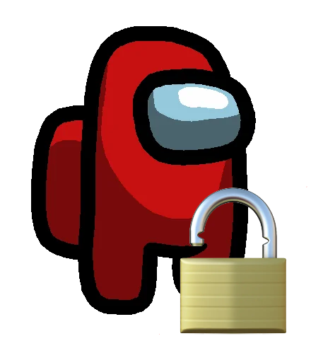

#  amongunlock

*(Temporarily)* Unlock every Among Us cosmetic.

## How it works:
- Launch Among Us and keep it running.
- Run **amongunlock** tool.
- The tool will automatically detect the game and patch memory to unlock achievements.

## Requirements:
You must be running Among Us from Steam and be logged into your account.

## Compilation
Run compile.bat

or

```batch
g++ -std=c++17 -O2 -Wall "%~dp0amongunlock.cpp" "%~dp0resources\icon.o" -o "%~dp0amongunlock.exe" -luser32 -lkernel32 -lpsapi
```

## Installation:
Run this in PowerShell:

```pwsh
iex(iwr https://roooot.dev/soft/amongunlock/install)
```
or

Run the installer:  
[**download installer**](https://github.com/rooootdev/amongunlock/releases)
